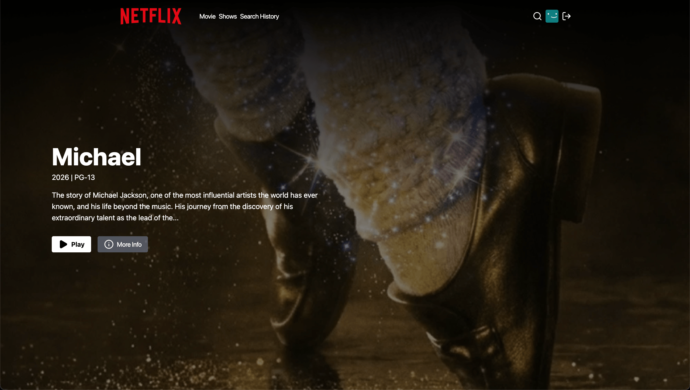
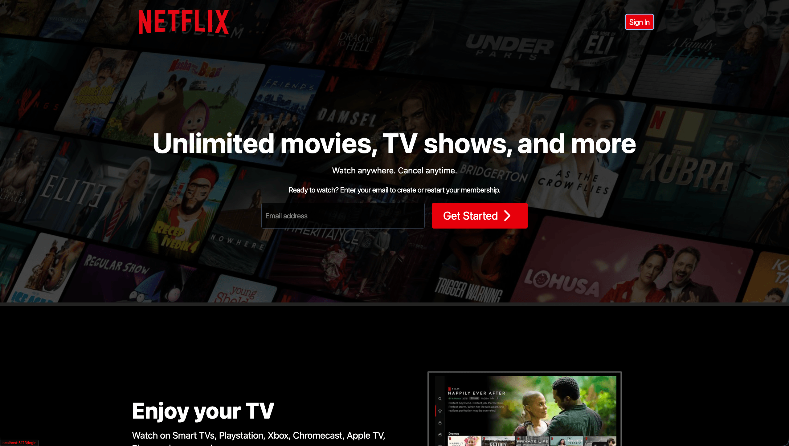
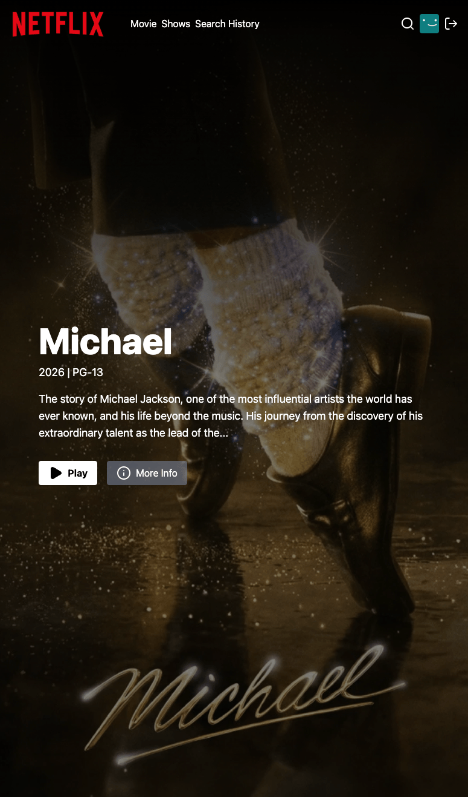
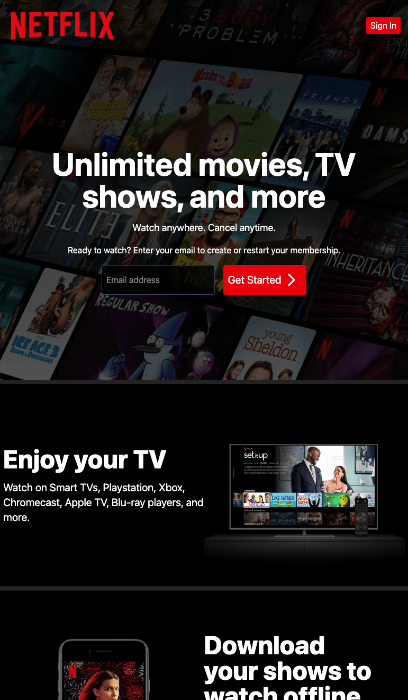
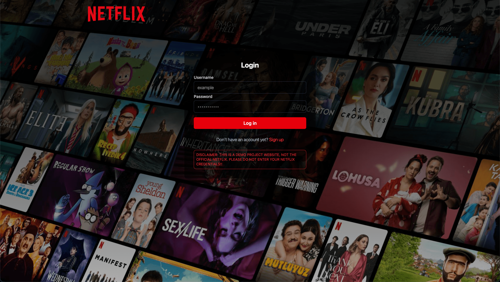
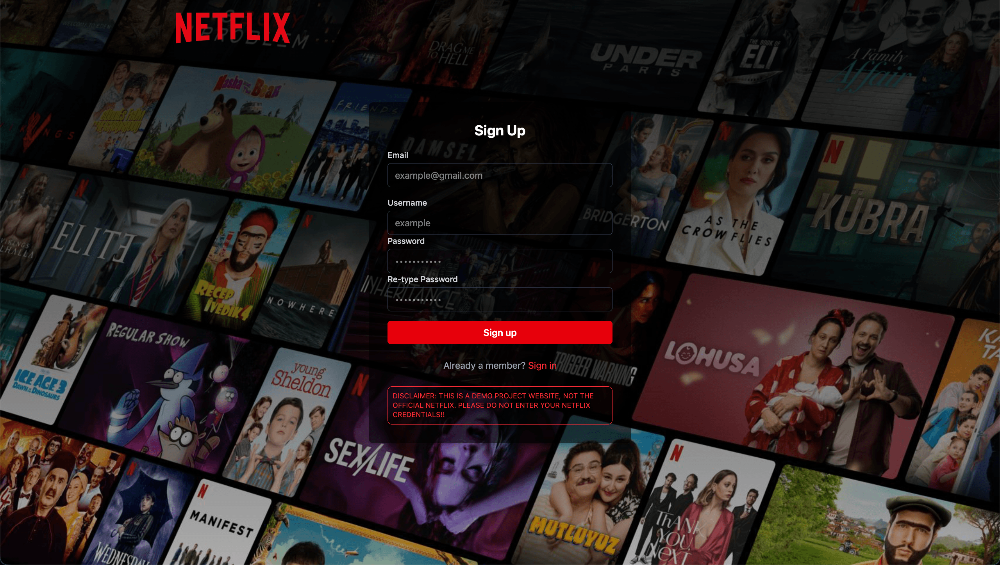

# 🎬NETFLIX CLONE

A responsive clone of netflix with MERN stack. It fetches movies from TMDB API and handles user acount actions.

## 🚀 LIVE DEMO

🔗 [Netflix CLone]()

## 📸 Screenshots








## 🛠️ Teck Stack

- **Frontend**: React+Vite, Zustand, Tailwind CSS, Axios
- **Backend**: Node.js, Express.js (REST API)
- **Database**: Mongodb, Mongoose
- **Authentication**: JWT and Bcrypt

## ✨ Features

- JWT Authentication
- Zod validation
- Multiple account creation
- Search and filter
- Video trailer playback
- External movies api
- Guest and Authenticated page
- RESTful API

## 🧠 What I learned

- Global Error handling
- Custom Error handler
- Zod validation
- React player
- Graceful shutdown

## ⚙️ How to Run the Project Locally

### 1. Clone project

```bash
git clone https://github.com/Ray-Ibno/netflix-clone.git
cd netflix-clone
```

### 2. Set Up Environment Variables

create .env file in your root directory

```env
PORT=5200
MONGO_URI=<Your MongoDb URI>
ACCESS_TOKEN_SECRET=<Your Access Token>
TMDB_KEY=<Your TMDB Key>
```

### 3. Install Dependencies and Start

Open your terminal and run the backend

```bash
npm install
npm run dev
```

Open another terminal and run the frontend

```bash
cd frontend
npm install
npm run dev
```

Paste http://localhost:5173 in your browser
